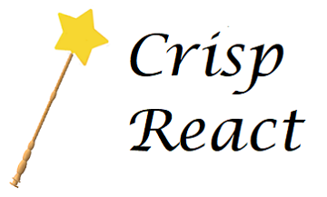

<!-- 

  
   
   

 

  
  
  
  

 -->

# Scouter

## About

Scouter is a Web app that allows FRC Teams to record match data, save it to a database, and retreive it for analysis. The two main aspects that makes Scouter unique is its ability to load custom database models and it's reliance on a competition legal LAN network. For more information, please refer to this repo's [wiki](https://github.com/NicolasNewman/Scouter/wiki)

## Highlights

- Flexible modules that allow teams to customize the database, data fourm, and analysis page to their liking
- Relies on a network architecture that doesn't need wireless signals, making it competition legal
- Users can connect straight from any browser on Windows, Mac, Linux, and ChromeOS

## License

The Scouter project with its 'server', 'client', and 'launcher' subprojects is open source software [licensed as MIT](./LICENSE).
